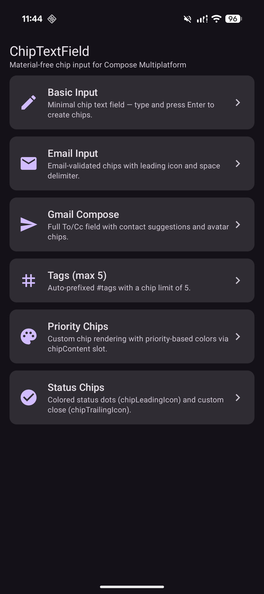
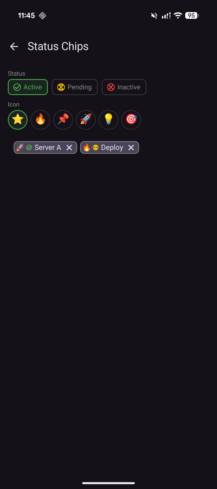

# Compose Chip TextField

A **Material-free** chip input field for Compose Multiplatform. Built entirely on Compose Foundation — works with Material 2, Material 3, or any custom design system.

[](https://central.sonatype.com/artifact/io.github.aldefy/chip-textfield)
[](https://kotlinlang.org)
[](https://www.jetbrains.com/compose-multiplatform/)
[](https://www.apache.org/licenses/LICENSE-2.0)

## Platforms

| Android | iOS | Desktop (JVM) | Web (Wasm) |
|:-------:|:---:|:-------------:|:----------:|
|    ✓    |  ✓  |       ✓       |     ✓      |

## Screenshots

<p align="center">
  
  
</p>

## Installation

```kotlin
// build.gradle.kts
dependencies {
    implementation("io.github.aldefy:chip-textfield:1.0.0-alpha01")
}
```

## Quick Start

```kotlin
val state = rememberChipTextFieldState<String>()

ChipTextField(
    state = state,
    onCreateChip = { text -> text.ifBlank { null } },
    placeholder = { Text("Type and press Enter...") },
)
```

## API

### ChipTextField

```kotlin
@Composable
fun <T> ChipTextField(
    state: ChipTextFieldState<T>,
    onCreateChip: (String) -> T?,
    modifier: Modifier = Modifier,
    chipContent: (@Composable (T, onRemove: () -> Unit) -> Unit)? = null,
    chipLabel: (T) -> String = { it.toString() },
    chipLeadingIcon: (@Composable ChipScope<T>.() -> Unit)? = null,
    chipTrailingIcon: (@Composable ChipScope<T>.() -> Unit)? = null,
    onChipRemoved: ((T) -> Unit)? = null,
    onQueryChanged: ((String) -> Unit)? = null,
    suggestionContent: @Composable ((query: String, onSuggestionSelected: (T) -> Unit) -> Unit)? = null,
    placeholder: @Composable (() -> Unit)? = null,
    leadingIcon: @Composable (() -> Unit)? = null,
    enabled: Boolean = true,
    readOnly: Boolean = false,
    delimiters: Set<Char> = ChipTextFieldDefaults.delimiters,
    maxChips: Int = Int.MAX_VALUE,
    colors: ChipTextFieldColors = ChipTextFieldDefaults.colors(),
    shape: Shape = ChipTextFieldDefaults.shape,
)
```

### Chip Customization

Three levels of customization:

**1. Slot icons** — add leading/trailing content to the default chip:

```kotlin
ChipTextField(
    state = state,
    onCreateChip = { /* ... */ },
    chipLeadingIcon = {
        // `this` is ChipScope<T> — access chip, enabled, colors, onRemove
        Icon(imageVector = Icons.Default.Tag, contentDescription = null)
    },
    chipTrailingIcon = {
        Icon(
            imageVector = Icons.Default.Close,
            contentDescription = "Remove",
            modifier = Modifier.clickable(onClick = onRemove),
        )
    },
)
```

**2. Full chip content** — replace the entire chip rendering:

```kotlin
ChipTextField(
    state = state,
    onCreateChip = { /* ... */ },
    chipContent = { chip, onRemove ->
        Row(
            modifier = Modifier
                .clip(RoundedCornerShape(16.dp))
                .background(Color.LightGray)
                .padding(horizontal = 12.dp, vertical = 6.dp),
        ) {
            Text(chip.toString())
            Icon(
                Icons.Default.Close,
                contentDescription = "Remove",
                modifier = Modifier.clickable(onClick = onRemove),
            )
        }
    },
)
```

**3. Colors and shape** — customize the default chip appearance:

```kotlin
ChipTextField(
    state = state,
    onCreateChip = { /* ... */ },
    colors = ChipTextFieldDefaults.colors(
        chipBackgroundColor = Color(0xFFE3F2FD),
        chipTextColor = Color(0xFF1565C0),
        chipBorderColor = Color(0xFF90CAF9),
    ),
    shape = RoundedCornerShape(12.dp),
)
```

### ChipScope

The scope received by `chipLeadingIcon` and `chipTrailingIcon`:

```kotlin
class ChipScope<T>(
    val chip: T,        // the chip data object
    val enabled: Boolean,
    val colors: ChipTextFieldColors,
    val onRemove: () -> Unit,  // call to remove this chip
)
```

### ChipTextFieldState

```kotlin
val state = rememberChipTextFieldState<String>()

// Or with initial chips:
val state = rememberChipTextFieldState(
    initialChips = listOf("Kotlin", "Compose")
)

// Programmatic access:
state.chips          // current chip list
state.addChip(chip)
state.removeChip(chip)
state.removeChipAt(index)
state.clearChips()
```

### Features

- **Delimiter support** — chips created on `,`, `\n`, or custom delimiters
- **Backspace removal** — pressing backspace on empty input removes the last chip
- **Max chips** — limit the number of chips with `maxChips`
- **Suggestions** — show a dropdown via `suggestionContent` that filters as you type
- **Validation** — return `null` from `onCreateChip` to reject input
- **Read-only mode** — display chips without editing

## Examples

The sample app includes 6 examples:

| Example | Demonstrates |
|---------|-------------|
| **Basic Input** | Minimal chip field |
| **Email Input** | Validation + leading icon + custom delimiters |
| **Gmail Compose** | Generic type chips + contact suggestions + avatars |
| **Tags** | Auto-prefix + max chip limit |
| **Priority Chips** | Full custom `chipContent` with color-coded levels |
| **Status Chips** | `chipLeadingIcon` + `chipTrailingIcon` + emoji icons |

Run the sample:

```bash
# Android
./gradlew :sample:installDebug

# Desktop
./gradlew :sample:run
```

## Building

```bash
# Build library
./gradlew :chip-textfield:build

# Run tests
./gradlew :chip-textfield:allTests

# API compatibility check
./gradlew :chip-textfield:apiCheck

# Maven Central staging bundle
./gradlew :chip-textfield:publishAllPublicationsToLocalStagingRepository \
    -Psigning.gnupg.keyName=YOUR_KEY_ID
```

## License

```
Copyright 2026 Adit Lal

Licensed under the Apache License, Version 2.0 (the "License");
you may not use this file except in compliance with the License.
You may obtain a copy of the License at

    http://www.apache.org/licenses/LICENSE-2.0

Unless required by applicable law or agreed to in writing, software
distributed under the License is distributed on an "AS IS" BASIS,
WITHOUT WARRANTIES OR CONDITIONS OF ANY KIND, either express or implied.
See the License for the specific language governing permissions and
limitations under the License.
```
